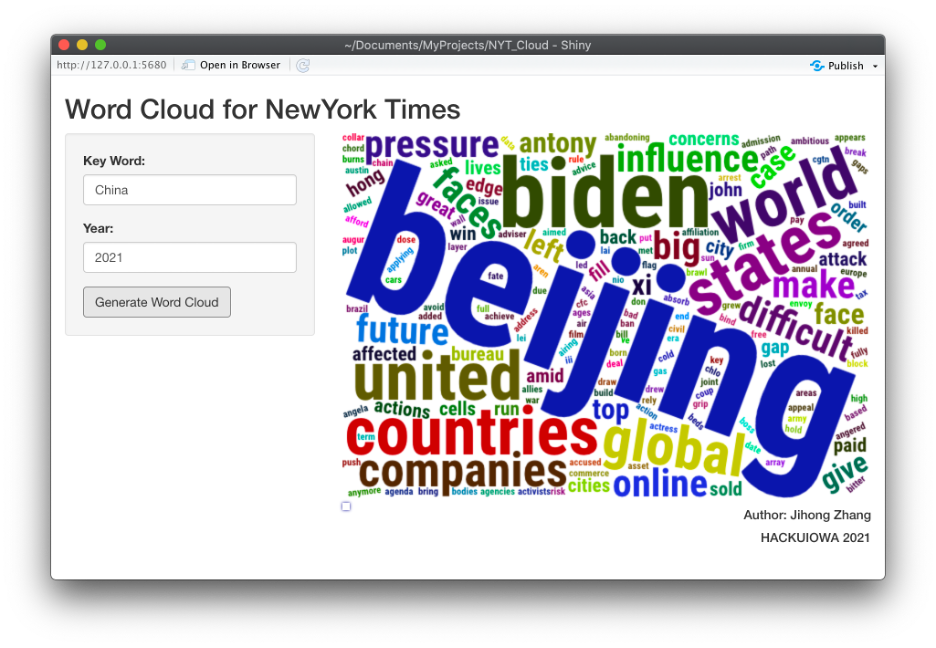

# Dumu-cloud （B站弹幕云）
使用R shiny来可视化B站视频弹幕。支持词云，直方图，折线图和主题分析。
A R shiny app to visualize the Danmu in Bilibili

# 功能:
1. 根据网址自动抓取视频弹幕并画出云（支持多个网址）

# To-do list
1. 根据关键字搜索来抓取视频并画出词云
2. 允许用户屏蔽【关键词】
3. 允许用户指定B站up主来定向抓取视频
